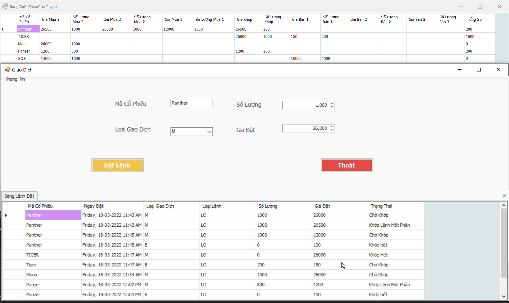
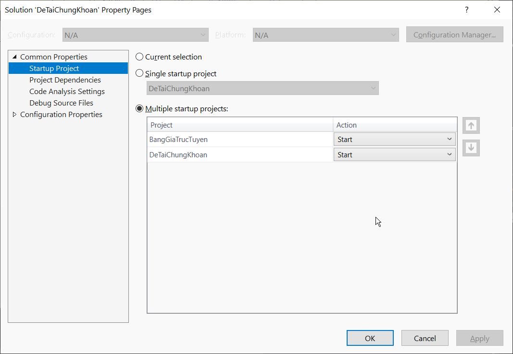

<h1 align="center">Chuyên Đề Công Nghệ Phần Mềm 
    Đề tài: Chứng Khoán
</h1>

    

# [**Table Of Content**](#table-of-content)
- [**Table Of Content**](#table-of-content)
- [**Introduction**](#introduction)
- [**Video**](#video)
- [**Instructions**](#instructions)
  - [**Topic Number 2**](#topic-number-2)
    - [**Explanation**](#explanation)
    - [**Illustration**](#illustration)
  - [**Topic Number 3**](#topic-number-3)
    - [**Explanation**](#explanation-1)
    - [**Illustration**](#illustration-1)
- [**Document**](#document)
- [**Score**](#score)
- [**Post Script**](#post-script)
- [**Timeline**](#timeline)
  - [**07-03-2022**](#07-03-2022)
  - [**08-03-2022**](#08-03-2022)
  - [**09-03-2022**](#09-03-2022)
- [**Made with 💘 and C# **](#made-with--and-c-)

# [**Introduction**](#introduction)
Chào các bạn, lại là mình, Phong nè 😋. Trong đồ án này mình sẽ giới thiệu các bạn tham khảo về đồ án môn Chuyên đề Công nghệ phần mềm do giảng viên huyền thoại - Lưu Nguyễn Kì Thư giảng dạy.

Với môn này, mình được nhận đề số 2. Tuy nhiên, để tăng thêm kinh nghiệm & tăng độ khó cho game😎. Mình quyết định làm cả đề số 3, cũng chung cơ sở dữ liệu với đề số 2 luôn ! Không nói nhiều nữa .

Los geht's 💥

# [**Video**](#video)

    

<h3 align="center">

***Không thích đọc nhiều? Hãy nhấn vào video để xem luôn giải thích thuật toán và chạy chương trình thực tế 😋😋***

# [**Instructions**](#instructions)

Để các bạn dễ nắm bắt & làm đồ án theo nhu cầu của bản thân thì mình sẽ viết nội dung phụ thuộc vào đề tài các bạn muốn làm nhé. Dù các bạn làm đề tài 2 hay đề tài 3 đều có thể tham khảo được

## [**Topic Number 2**](#topic-number-2)

### [**Explanation**](#explanation2)

Muốn làm đề tài này các bạn cần hiểu Cursor là gì ? Nếu chưa biết thì vào [**đây**](https://youtu.be/8tKf-PqdrAg?t=1466) học nhé 🥱.

Tiếp theo, để có thể hoàn thiện được cái Stored Procedure thầy cho nhưng chưa hoàn thiện. Các bạn cần hiểu cách thuận toán này hoạt động qua ví dụ phía dưới đây:

### [**Illustration**](#illustration2)
Giả sử chúng ta các một bảng Lệnh Đặt như hình dưới

| ID | Mã Cổ Phiếu | Ngày Đặt   | Loại Giao Dịch | Loại Lệnh | Số Lượng | Giá Đặt |
|----|-------------|------------|----------------|-----------|----------|---------|
| 1  | Panther     | 01-05-2022 | M              | LO        | 1000     | 10000   |
| 2  | Panther     | 01-05-2022 | M              | LO        | 1000     | 10500   |
| 3  | Panther     | 01-05-2022 | M              | LO        | 1500     | 11000   |
| 4  | Panther     | 01-05-2022 | M              | LO        | 1000     | 9500    |
| 5  | Tiger       | 01-05-2022 | B              | LO        | 2700     | 10200   |

Giờ chúng ta ra một lệnh BÁN có thông tin như sau:

| ID | Mã Cổ Phiếu | Ngày Đặt   | Loại Giao Dịch | Loại Lệnh | Số Lượng | Giá Đặt |
|----|-------------|------------|----------------|-----------|----------|---------|
| 6  | Panther     | 01-05-2022 | B              | LO        | 2700     | 10200   |

Để thực hiện lệnh này thì chúng ta sẽ dùng câu SQL như sau

    exec [sp_KhopLenhLienTuc] 'Panther', '2022-03-08', 'B', 2700, 10200

Khi chạy câu lệnh này, thì trình tự xử lý sẽ như sau:

**Bước 1:** Vì giao dịch gửi tới là `B` (Bán) nên Cursor tìm tất cả các lệnh giao dịch `M` (Mua). Lệnh giao dịch `M` nào giá mua cao nhất thì ưu tiên khớp trước, rồi tới các giá đặt thấp dần đều. Trong trường hợp có 2 lệnh đều cùng giá đặt thì ưu tiên thời gian từ cũ tới mới. Chúng sẽ có thứ tự như bảng phía dưới đây:

| ID | Mã Cổ Phiếu | Ngày Đặt   | Loại Giao Dịch | Loại Lệnh | Số Lượng | Giá Đặt |
|----|-------------|------------|----------------|-----------|----------|---------|
| 3  | Panther     | 01-05-2022 | M              | LO        | 1000     | 11000   |
| 2  | Panther     | 01-05-2022 | M              | LO        | 1000     | 10500   |
| 1  | Panther     | 01-05-2022 | M              | LO        | 1500     | 10000   |
| 4  | Panther     | 01-05-2022 | M              | LO        | 1000     | 9500    |

**Bước 2:** Khớp lệnh lần lượt từ giao dịch `M` có giá mua cao nhât trước với giá khớp luôn ưu tiên giá mua >= giá bán

Giao dịch `B` có số lượng là *2700* & giao dịch `M` với ID = 3 có số lượng là 1000. Số lượng còn lại của giao dịch `B` là 1700. Giá khớp là *11000*

Giao dịch `B` có số lượng là *1700* & giao dịch `M` với ID = 2 có số lượng là 1000. Số lượng còn lại của giao dịch `B` là 700. Giá khớp là *10500*

Đến đây, giao dịch này không thể tiếp tục bởi giao dịch `M` với ID = 1 có giá mua thấp hơn giá bán của `B` nên stored procedure này sẽ dừng lại.

**Bước 3:** Vậy sau khi kết thúc phiên khớp lệnh thì bảng LỆNH ĐẶT phía trên sẽ có hình dạng như sau:

| ID | Mã Cổ Phiếu | Ngày Đặt   | Loại Giao Dịch | Loại Lệnh | Số Lượng | Giá Đặt | Trạng Thái |
|----|-------------|------------|----------------|-----------|----------|---------|------------|
| 1  | Panther     | 01-05-2022 | M              | LO        | 1000     | 10000   | Chờ khớp   |
| 2  | Panther     | 01-05-2022 | M              | LO        | 0        | 10500   | Khớp hết   |
| 3  | Panther     | 01-05-2022 | M              | LO        | 0        | 11000   | Khớp hết   |
| 4  | Panther     | 01-05-2022 | M              | LO        | 1000     | 9500    | Chờ khớp   |
| 5  | Tiger       | 01-05-2022 | B              | LO        | 2700     | 10200   | Chờ khớp   |
| 6  | Panther     | 01-05-2022 | B              | LO        | 700      | 10200   | Khớp lệnh 1 phần |

Giao dịch `B` với ID = 6 sẽ ở trong bảng này để chờ các lệnh `M` khác gửi tới và khớp tiếp.

Ở bảng LỆNH KHỚP, chúng ta sẽ có dữ liệu như sau

| ID | Ngày Khớp  | Số Lượng Khớp | Giá Khớp | ID Lệnh Đặt |
|----|------------|---------------|----------|-------------|
| 1  | 01-05-2022 | 1000          | 11000    | 3           |
| 2  | 01-05-2022 | 1000          | 10500    | 2           |

**Bước 4:** Nếu đã hiểu & làm xong Stored Procedure và thiết kế giao diện đơn giản như dưới đây là coi như bạn đã hoàn thiệt đề tài số 2 rồi á !

    

<space>

<h2 align="center">

  *Giao diện màn hình giao dịch*
</h2>

## [**Topic Number 3**](#topic-number-3)

### [**Explanation**](#explanation3)
Để làm đề tài 3, các bạn cần tìm hiểu 3 vấn đề sau

- Trigger là gì ? 

- Dịch vụ SQL Broker trong SQL Server và cách hoạt động ? 

- SQL Dependency trong C# là gì ? 

Nếu chưa biết 3 đứa này là gì thì hãy nhấn vào [**đây**](https://www.youtube.com/watch?v=YR51M3RU0ek&t=941s&ab_channel=PHONGPH%E1%BA%A0M) để tìm hiểu nha 😋.

Vậy tại sao phải dùng Trigger ? Vì Trigger là Stored Procedure đặc biệt tự kích hoạt khi có một hành động nào đó xảy ra. Ở đề tài 3, các bạn có thể thấy mỗi khi chúng ta lập một giao dịch mua | bán cổ phiếu. Thì ngay sau khi lập giao dịch xong, bảng giá trực tuyến cần được hoạt động ngay lập tức để hiển thị giá cổ phiếu mới. Và Trigger chính là chìa khóa 🔑 để giải quyết vấn đề này.

Vậy SQL Broker là cái chi chi ? Nó là dịch vụ của SQL Server, dùng để theo dõi các hành động thay đổi dữ liệu trên một bảng dữ liệu nào đó. Nhờ có dịch vụ này mà khi làm có một thao tác xảy ra thì nó sẽ cập nhật dữ liệu trong Data Grid View ngay lập tức.
Nhược điểm duy nhất là do cần theo dõi nên SQL Broker sẽ liên tục gửi yêu cầu tới SQL Server, do vậy nên ứng dụng sử dụng dịch vụ SQL Broker sẽ bị chậm đi đôi chút.

Để làm đề tài này các bạn sẽ cần tạo thêm một bảng giá trực tuyến có hình thức như dưới 👇

| ID | Giá Mua 1 | Số Lượng Mua 1 | Giá Mua 2 | Số Lượng Mua 2 | Giá Bán 1 | Số Lượng Bán 1 | Giá Bán 2 | Số Lượng Bán 2 | Giá Khớp | Số Lượng Khớp | Tổng Số |
|----|-----------|----------------|-----------|----------------|-----------|----------------|-----------|----------------|----------|---------------|---------|

Trong cột Giá mua : sẽ lưu 2 giá mua tốt nhất. Tức giá mua cao nhất và cao thứ 2 của cổ phiếu đó

Trong cột Giá bán : sẽ lưu 2 giá bán tốt nhất. Tức giá bán thấp nhất và thấp thứ 2 của cổ phiếu đó

Trong 2 cột khớp lệnh : thể hiện giá khớp, số lượng khớp từ giao dịch mua hoặc bán mới nhất.

Trong cột Tổng số : sẽ hiển thị tổng số cổ phiếu đã được được khớp lệnh

Trong cột số lượng: sẽ là tổng số lượng cổ phiếu đang được bán với mức giá đó. Ví dụ: một giao dịch bán Tiger là 1000 & một giao dịch bán Tiger khác là 2000 và cùng bán giá 12.000 thì số lượng bán là 3000

> Trong đề tài của mình thì mình có các cột giá mua | bán 3 nữa nhưng chỉ cần như trên là các bạn cũng nắm ý tưởng rồi 🤟

Ở đề tài số 3, chúng ta sẽ cần dùng tới 2 trigger để hoàn thiện đề tài này. 

- Trigger thứ nhất sẽ cập nhật dữ liệu các cột giá mua, giá bán trong **Bảng giá trực tuyến** mỗi khi có một giao dịch được tạo ra.

- Trigger thứ hai sẽ cập nhật cột giá khớp và số lượng khớp của giao dịch mới nhất vừa được thực hiện trong **Bảng giá trực tuyến**

Để cập nhật tổng số lượng cổ phiếu đã khớp. Các bạn hãy tải dự án này về, mở thư mục `Stored Procedure` & tìm đọc Stored Procedure khớp lệnh liên tục để đọc qua trình tự xử lý của nó.

### [**Illustration**](#illustration3)

Giả sử có 3 lệnh SQL như sau: 

    exec [sp_KhopLenhLienTuc] 'Panther', '2022-02-22', 'M', 2500, 9000

    exec [sp_KhopLenhLienTuc] 'Panther', '2022-02-22', 'M', 1000, 15000

    exec [sp_KhopLenhLienTuc] 'Panther', '2022-02-22', 'M', 1200, 12000

Và

    exec [sp_KhopLenhLienTuc] 'Tiger', '2022-02-22', 'B', 1300, 14000

    exec [sp_KhopLenhLienTuc] 'Tiger', '2022-02-22', 'B', 2100, 10000

    exec [sp_KhopLenhLienTuc] 'Tiger', '2022-02-22', 'B', 1700, 16000

Cuối cùng 

    exec [sp_KhopLenhLienTuc] 'Tiger', '2022-02-22', 'M', 500, 15000

Vậy bảng giá trực tuyến sẽ như sau

| Mã Cổ Phiếu | Giá Mua 1 | Số Lượng Mua 1 | Giá Mua 2 | Số Lượng Mua 2 | Giá Bán 1 | Số Lượng Bán 1 | Giá Bán 2 | Số Lượng Bán 2 | Giá Khớp | Số Lượng Khớp | Tổng số |
|-------------|-----------|----------------|-----------|----------------|-----------|----------------|-----------|----------------|----------|---------------|---------|
| Panther     | 15000     | 1000           | 12000     | 1200           |           |                |           |                |          |               | 0       |
| Tiger       |           |                |           |                | 10000     | 1600           | 14000     | 1300           | 10000    | 500           | 500      |

Đến đây thì coi như xong đề tài 3 luôn rồi !

> Note: cái phần ngày phải lấy ngày mới nhất tại thời điểm các bạn đang xem bài viết này nha. Ngày '2022-02-22' là ngày mình viết README này😛😛

    

<space>

<h2 align="center">

  *Giao diện màn hình ứng dụng*
</h2>

>Note: Để chạy được 2 ứng dụng trên Visual Studio 2019 cùng lúc hãy vào **Solution->Properties->Common Properties->Startup Project->Chọn Multiple startup project**
>. Phần action hãy chọn "Start" những ứng dụng bạn mong muốn chạy cùng lúc

    

<space>

<h2 align="center">

  *Chọn 2 ứng dụng chạy cùng lúc*
</h2>

# [**Document**](#document)

Khi tải dự án này về các bạn sẽ có

- Thư mục DeTaiChungKhoan: Source Code của mình & comment giải thích 

- Thư mục Stored Procedure: các SQL Query cần thiết để dựng cơ sở dữ liệu 

- Thư mục Document: tài liệu học tập về các kiến thức được liệt kê bên trên

# [**Score**](#score)

Bất kì ai học những môn do thầy Thư dạy sẽ nhận được một mã gồm 3 chữ số abc thay vì điểm thông thường. Theo như mình biết thì có 2 cách tính điểm sau. Tuy nhiên, cách 1 thường phổ biển hơn & sau khi học đến năm 4 thì mình thấy là cách tính này là ko đổi đối với mọi niên khóa.

Mã điểm là a b c

Cách 1: ( b + c ) % 10

Cách 2: ( a + b + c ) % 10

Cách 3: c

Với khóa của mình cách 3 là lấy luôn chữ số cuối cùng là điểm số. Với số 0 nghĩa là 10 điểm.

Ví dụ 1: 790 -> 10 điểm

Ví dụ 2: 478 -> 8 điểm

# [**Post Script**](#post-script)

Nếu các bạn thấy bài viết & đồ án này hữu ích. Đừng ngần ngại tặng một ngôi sao ⭐ cho mình nha !

Khi bạn đã học môn này, tức bạn đã là sinh viên sắp ra trường. Vậy nên thầy Thư cũng rất tạo điều kiện cho sinh viên chúng ta. 

"Cái môn này là kiến thức thêm, các bạn biết thêm thì tốt mà không biết thì cũng chẳng sao. Các em học đến đây là cũng gần ra trường rồi ! 
Nên tôi cũng cố gắng tạo điều kiện cho các em ra trường. Nhưng các em phải chịu khó học! Chỉ có 2 trường hợp tôi buộc phải cho các em rớt. Một là các em bỏ thi. Hai là các em làm quá sơ sài, không đạt yêu cầu. 
Còn những môn như Cấu trúc dữ liệu hay Cơ sở dữ liệu phân tán là kiến thức chuyên ngành để các em đi làm nên tôi muốn các em học nghiêm túc. Vậy thôi ✨  " - Thầy nói

Chúc các bạn đang đọc bài này sẽ ra trường đúng hạn & đạt nhiều thành công trong cuộc sống nha 💕

    

# [**Timeline**](#timeline)

## [**07-03-2022**](#07-03-2022)

- Tìm hiểu Cursor 

- Hiểu và hoàn thiện Stored Procedure khớp lệnh liên tục

## [**08-03-2022**](#08-03-2022)

- Tìm hiểu Trigger

- Thêm bảng giá trực tuyến

- Viết Trigger ở bảng lệnh đặt và lệnh khớp để cập nhật dữ liệu cho bảng trực tuyến

## [**09-03-2022**](#09-03-2022)

- Tìm hiểu SQL Dependency

- Tìm hiểu dịch vụ SQL Broker

- Hoàn thiện đồ án kết hợp cả đề 2 & 3

# [**Made with 💘 and C# **](#made-with-love-and-c)
