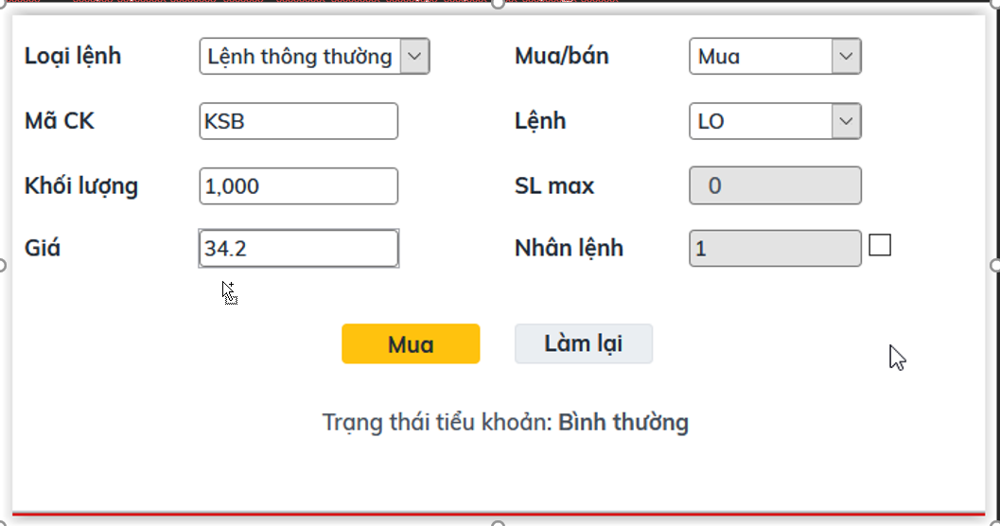

<h1 align="center">Chuyên Đề Công Nghệ Phần Mềm 
    Đề tài: Chứng Khoán
</h1>

    

# [**Table Of Content**](#table-of-content)
- [**Table Of Content**](#table-of-content)
- [**Introduction**](#introduction)
- [**How To Read**](#how-to-read)
  - [**Topic Number 2**](#topic-number-2)
  - [**Topic Number 3**](#topic-number-3)
- [**Post Script**](#post-script)
- [**Timeline**](#timeline)
  - [**07-03-2022**](#07-03-2022)
  - [**08-03-2022**](#08-03-2022)
- [**Made with 💘 and PHP **](#made-with--and-php-)

# [**Introduction**](#introduction)
Chào các bạn, lại là mình, Phong nè 😋. Trong đồ án này mình sẽ giới thiệu các bạn tham khảo về đồ án môn Chuyên đề Công nghệ phần mềm do giảng viên huyền thoại - Lưu Nguyễn Kì Thư giảng dạy.

Với môn này, mình được nhận đề số 2. Tuy nhiên, để tăng thêm kinh nghiệm & tăng độ khó cho game😎. Mình quyết định làm cả đề số 3, cũng chung cơ sở dữ liệu với đề số 2 luôn ! Không nói nhiều nữa .

Los geht's 💥

# [**How To Read**](#how-to-read)

Để các bạn dễ nắm bắt & làm đồ án theo nhu cầu của bản thân thì mình sẽ viết nội dung phụ thuộc vào đề tài các bạn muốn làm nhé. Nếu các bạn làm đề tài số 3 thì vẫn có thể tham khảo được

## [**Topic Number 2**](#topic-number-2)

Muốn làm đề tài này các bạn cần hiểu Cursor là gì ? Nếu chưa biết thì vào [**đây**](https://youtu.be/8tKf-PqdrAg?t=1466) học nhé 🥱. 
Tiếp theo, để có thể hoàn thiện được cái Stored Procedure thầy cho nhưng chưa hoàn thiện. Các bạn cần hiểu cách thuận toán này hoạt động qua ví dụ phía dưới đây:

Giả sử chúng ta các một bảng Lệnh Đặt như hình dưới

| ID | Mã Cổ Phiếu | Ngày Đặt   | Loại Giao Dịch | Loại Lệnh | Số Lượng | Giá Đặt |
|----|-------------|------------|----------------|-----------|----------|---------|
| 1  | Panther     | 01-05-2022 | M              | LO        | 1000     | 10000   |
| 2  | Panther     | 01-05-2022 | M              | LO        | 1000     | 10500   |
| 3  | Panther     | 01-05-2022 | M              | LO        | 1500     | 11000   |
| 4  | Panther     | 01-05-2022 | M              | LO        | 1000     | 9500    |
| 5  | Tiger       | 01-05-2022 | B              | LO        | 2700     | 10200   |

Giờ chúng ta ra một lệnh BÁN có thông tin như sau:

| ID | Mã Cổ Phiếu | Ngày Đặt   | Loại Giao Dịch | Loại Lệnh | Số Lượng | Giá Đặt |
|----|-------------|------------|----------------|-----------|----------|---------|
| 6  | Panther     | 01-05-2022 | B              | LO        | 2700     | 10200   |

Để thực hiện lệnh này thì chúng ta sẽ dùng câu SQL như sau

    exec [sp_KhopLenhLienTuc] 'AC', '2022-03-08', 'B', 2700, 12500

Khi chạy câu lệnh này, thì trình tự xử lý sẽ như sau:

**Bước 1:** Cursor tìm tất cả các lệnh giao `M` vì giao dịch gửi tới là `B` và trình tự sắp xếp sẽ ưu tiên giá mua từ cao tới thấp, thời gian từ mới tới cũ. Chúng sẽ có thứ tự như bảng phía dưới đây

| ID | Mã Cổ Phiếu | Ngày Đặt   | Loại Giao Dịch | Loại Lệnh | Số Lượng | Giá Đặt |
|----|-------------|------------|----------------|-----------|----------|---------|
| 3  | Panther     | 01-05-2022 | M              | LO        | 1000     | 11000   |
| 2  | Panther     | 01-05-2022 | M              | LO        | 1000     | 10500   |
| 1  | Panther     | 01-05-2022 | M              | LO        | 1500     | 10000   |
| 4  | Panther     | 01-05-2022 | M              | LO        | 1000     | 9500    |

**Bước 2:** Khớp lệnh lần lượt từ giao dịch `M` có giá mua cao nhât trước với giá khớp luôn ưu tiên giá mua >= giá bán

Giao dịch `B` có số lượng là *2700* & giao dịch `M` với ID = 3 có số lượng là 1000. Số lượng còn lại của giao dịch `B` là 1700. Giá khớp là *11000*

Giao dịch `B` có số lượng là *1700* & giao dịch `M` với ID = 2 có số lượng là 1000. Số lượng còn lại của giao dịch `B` là 700. Giá khớp là *10500*

Đến đây, giao dịch này không thể tiếp tục bởi giao dịch `M` với ID = 1 có giá mua thấp hơn giá bán của `B` nên stored procedure này sẽ dừng lại.

**Bước 3:** Vậy sau khi kết thúc phiên khớp lệnh thì bảng LỆNH ĐẶT phía trên sẽ có hình dạng như sau:

| ID | Mã Cổ Phiếu | Ngày Đặt   | Loại Giao Dịch | Loại Lệnh | Số Lượng | Giá Đặt |
|----|-------------|------------|----------------|-----------|----------|---------|
| 1  | Panther     | 01-05-2022 | M              | LO        | 1000     | 10000   |
| 2  | Panther     | 01-05-2022 | M              | LO        | 0        | 10500   |
| 3  | Panther     | 01-05-2022 | M              | LO        | 0        | 11000   |
| 4  | Panther     | 01-05-2022 | M              | LO        | 1000     | 9500    |
| 5  | Tiger       | 01-05-2022 | B              | LO        | 2700     | 10200   |
| 6  | Panther     | 01-05-2022 | B              | LO        | 700      | 10200   |

Giao dịch `B` với ID = 6 sẽ ở trong bảng này để chờ các lệnh `M` khác gửi tới và khớp tiếp.

Ở bảng LỆNH KHỚP, chúng ta sẽ có dữ liệu như sau

| ID | Ngày Khớp  | Số Lượng Khớp | Giá Khớp | ID Lệnh Đặt |
|----|------------|---------------|----------|-------------|
| 1  | 01-05-2022 | 1000          | 11000    | 3           |
| 2  | 01-05-2022 | 1000          | 10500    | 2           |

**Bước 4:** Nếu đã hiểu & làm xong Stored Procedure và thiết kế giao diện đơn giản như dưới đây là coi như bạn đã hoàn thiệt đề tài số 2 rồi á !

    

<space>

<h2 align="center">

  *Giao diện màn hình giao dịch*
</h2>

## [**Topic Number 3**](#topic-number-3)

# [**Post Script**](#post-script)

Nếu các bạn thấy bài viết này hữu ích. Đừng ngần ngại tặng một ⭐ cho mình nha !

# [**Timeline**](#timeline)

## [**07-03-2022**](#07-03-2022)

- Tìm hiểu Cursor 

- Hiểu và hoàn thiện Stored Procedure khớp lệnh liên tục

## [**08-03-2022**](#08-03-2022)

- Tìm hiểu Trigger

- Thêm bảng giá trực tuyến

- Viết Trigger ở bảng lệnh đặt và lệnh khớp để cập nhật dữ liệu cho bảng trực tuyến

# [**Made with 💘 and PHP **](#made-with-love-and-php)